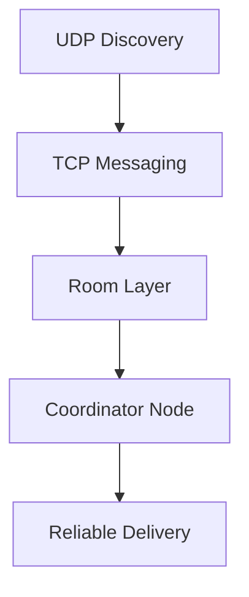
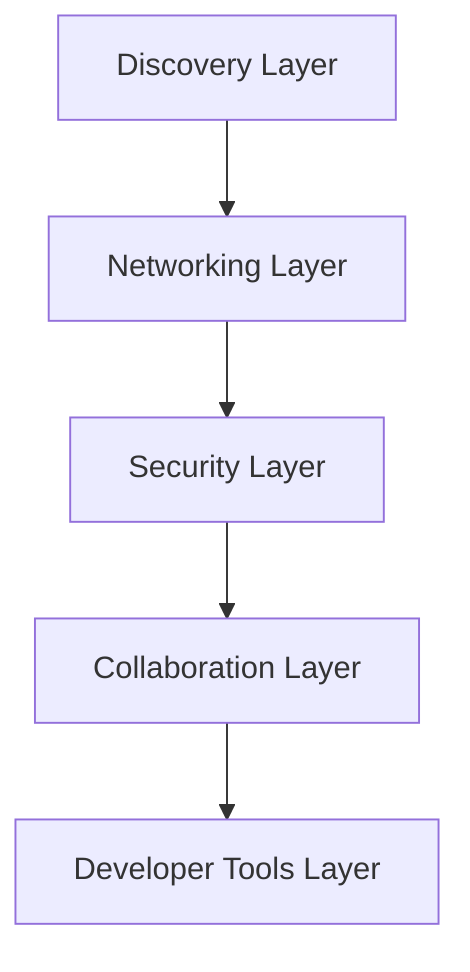

# DevHub LAN

**A LAN-first, peer-to-peer developer collaboration platform built with Electron, TypeScript, and distributed networking principles.**

DevHub LAN is built for developers and local teams who need a robust collaboration tool without relying on the internet or external cloud providers. It utilizes an offline-first, peer-to-peer architecture for direct device-to-device communication over Local Area Networks.

## Features

| Feature               | Status |
| --------------------- | ------ |
| Peer Discovery        | ✅      |
| Direct Messaging      | ✅      |
| Room System           | ✅      |
| Group Messaging       | ✅      |
| Leader Election       | ✅      |
| Reliable Delivery     | ✅      |
| End-to-End Encryption | 🚧     |
| File Sharing          | 📋     |
| Code Collaboration    | 📋     |
| Voice Communication   | 📋     |
| Screen Sharing        | 📋     |

## Architecture Overview

### Current Architecture



### Future Architecture



## Development Roadmap

### Phase 1 — Core LAN Communication ✅ Completed
- UDP Peer Discovery
- TCP Direct Messaging
- Presence System
- User Identity
- Zustand State Management
- Electron IPC Bridge
- Real-Time Chat
- Device Discovery

### Phase 2 — Rooms & Collaboration ✅ Completed
- Room Creation & Discovery
- Group Messaging
- Reliable Message Delivery (ACK System)
- Room Synchronization
- Coordinator Architecture
- Leader Election
- Role Management
- Persistence Layer

### Phase 3 — Security & Trust Infrastructure 🚧 In Progress
- RSA Identity System
- AES Session Encryption
- Device Trust Management
- Secure Handshake Protocol
- Room Key Management
- Key Rotation
- Security Dashboard

### Phase 4 — High Performance File Transfer 📋 Planned
- File/Folder Sharing
- Transfer Resume
- Compression & Integrity Verification

### Phase 5 — Real-Time Code Collaboration 📋 Planned
- Monaco Editor Integration
- Shared Editing & Cursor Presence
- CRDT Synchronization
- Snippet Sharing

### Phase 6 — Voice Communication 📋 Planned
- Voice Rooms & Push-to-Talk
- Opus Audio Streaming
- Voice Activity Detection

### Phase 7 — Screen Sharing 📋 Planned
- Window/Screen Sharing
- Multi-Monitor Support

### Phase 8 — LAN Workspace 📋 Planned
- Shared Notes & Whiteboard
- Kanban Boards & Team Tasks

### Phase 9 — Advanced Networking 📋 Planned
- mDNS Discovery
- Bandwidth Monitoring & Diagnostics
- Auto-Reconnect

### Phase 10 — DevHub LAN Pro 📋 Planned
- Shared Terminal & Project Sync
- Local AI Assistant
- Team Collaboration Suite

## Project Structure
```text
src/
├── main/            # Electron Main Process (Node.js)
│   ├── discovery/   # UDP Broadcasting and Peer Management
│   ├── networking/  # TCP Client/Server and Reliable Delivery
│   ├── rooms/       # Room Coordination and Election Logic
│   ├── security/    # Encryption, Trust, and Handshakes
│   └── storage/     # File-based persistence
├── renderer/        # React Frontend
│   ├── components/  # UI Components
│   └── store/       # Zustand State Management
└── shared/          # Types and IPC Constants
```

## Documentation
Please refer to the [docs/README.md](docs/README.md) for detailed architecture documents, roadmaps, low-level designs, and ADRs.

## Contributing
1. Fork the repository
2. Create your feature branch (`git checkout -b feature/amazing-feature`)
3. Commit your changes (`git commit -m 'Add some amazing feature'`)
4. Push to the branch (`git push origin feature/amazing-feature`)
5. Open a Pull Request

## License

[Apache License 2.0](LICENSE)
