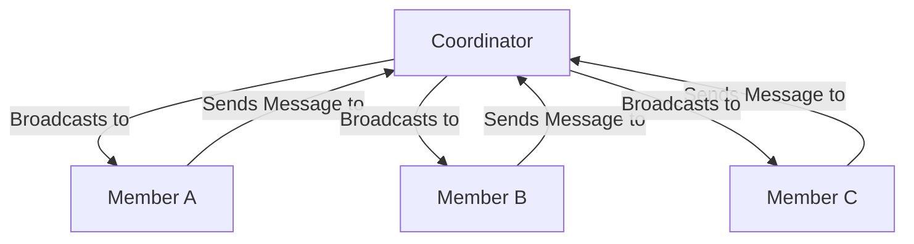
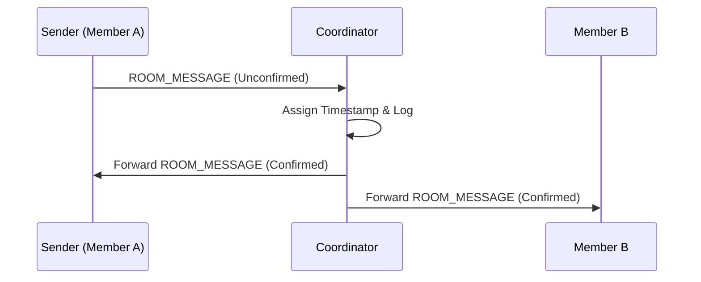

# Coordinator Pattern LLD

## Purpose
Define the Coordinator Pattern utilized by DevHub LAN to manage state synchronization and message routing within decentralized rooms.

## Goals
- **Reduce Complexity**: Avoid full N-to-N mesh networking for every room action.
- **Enforce Ordering**: Guarantee all members see messages in the exact same chronological order.
- **Single Source of Truth**: Resolve conflicts automatically by designating one node as the authoritative state manager.

## Design Decisions

### Why a Coordinator?
In a pure peer-to-peer mesh network, if 5 people are in a room and two people send a message at the exact same millisecond, network latency dictates that different peers will receive the messages in different orders. This breaks chronological consistency.

By adopting a **Star Topology** around a temporary "Coordinator" (the Room Owner), we force all actions through a single bottleneck. The Coordinator assigns timestamps and sequence IDs, ensuring absolute consistency.

### Topology

## Internal Architecture (`RoomCoordinator.ts`)

When a peer creates a room, they become the Coordinator. Their local `RoomCoordinator` instance binds to that `roomId` and listens for:
1. **Join Requests**: Authenticates and adds members.
2. **Room Messages**: Receives a raw message, appends an authoritative timestamp, logs it locally, and loops through all active members to forward it.

### Forwarding Logic
If a message fails to reach a member (e.g., the member disconnected silently), the `ReliableSender` detects the failure. The Coordinator will eventually mark that member as offline and broadcast a `ROOM_STATE_SYNC` removing them from the active list.

## Sequence Flow

## Future Improvements
- **Sub-Coordinators**: If a room grows past 50 members, a single Coordinator might become bottlenecked due to TCP socket limits on typical consumer hardware. Implementing regional sub-coordinators could alleviate this.
- **Vector Clocks**: Introduce Lamport Timestamps or Vector Clocks for true offline capability, where members can continue chatting while disconnected and merge their states back into the Coordinator later.