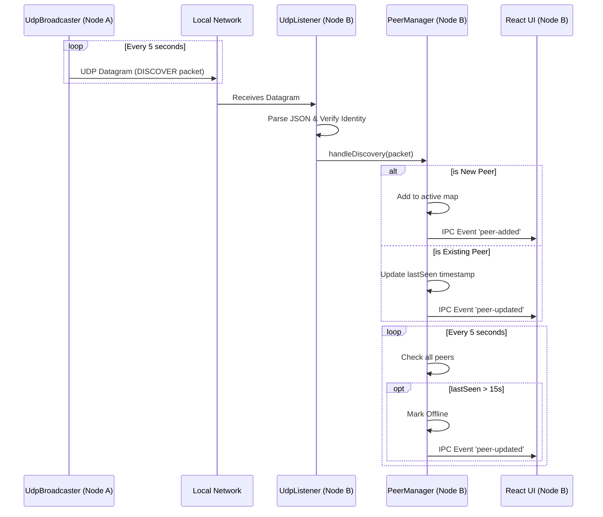

# Discovery System LLD

## Purpose
Define the low-level architecture, protocols, and data structures for the DevHub LAN peer discovery system. The discovery system is responsible for enabling devices on the same Local Area Network (LAN) to automatically find each other and maintain an accurate, real-time list of available peers without relying on any centralized server or DNS configuration.

## Goals
- **Decentralization**: Nodes must discover each other natively without a bootstrap server.
- **Low Overhead**: Discovery traffic must be lightweight and not flood the network.
- **Robust State Management**: The system must quickly identify when a peer goes offline or drops off the network.
- **Self-Filtering**: Nodes must ignore their own discovery packets to avoid duplicate looping.

## Architecture

The discovery system is split into three primary components running in the Electron Main process:
1. `UdpBroadcaster`: Periodically broadcasts presence packets.
2. `UdpListener`: Listens for incoming broadcasts and validates them.
3. `PeerManager`: Maintains the state of all discovered peers and handles lifecycle timeouts.

## Design Decisions

### Why UDP Broadcasts?
TCP requires knowing the target IP address to establish a handshake. Since peers start with zero knowledge of the network topology, we must use UDP broadcasts (specifically targeting `255.255.255.255` or the subnet broadcast address) to announce presence to all listening nodes simultaneously.

### Timing Intervals
- **Broadcast Interval (`DISCOVERY_INTERVAL_MS`)**: Set to 5000ms (5 seconds). This provides a fast discovery experience while remaining negligible in network overhead.
- **Timeout Interval**: Set to 15000ms (15 seconds). If 3 consecutive intervals pass without hearing from a peer, the `PeerManager` marks them as `Offline`.

### Payload Structure
Discovery packets are sent as plaintext JSON (prior to Phase 3 security upgrades) to ensure fast parsing.
```typescript
interface DiscoveryPacket {
  type: 'DISCOVER';
  username: string;       // The user's display name
  deviceName: string;     // The OS hostname
  ip: string;             // The sender's local IPv4 address
  tcpPort: number;        // The port the sender is listening on for TCP connections
  timestamp: number;      // Used to detect stale packets
  signature?: string;     // Added in Phase 3 for verification
  publicKey?: string;     // Added in Phase 3 for verification
}
```

## Sequence Flow



## Future Improvements
- **mDNS / Bonjour Integration**: While UDP broadcasts are reliable on most /24 subnets, corporate networks often block `255.255.255.255`. Upgrading the discovery layer to utilize ZeroConf/mDNS will increase reliability in restricted enterprise environments.
- **Differential Updates**: Instead of broadcasting the full profile (avatar, device name) every 5 seconds, broadcast a small ping hash. If the hash changes, peers request the full profile over TCP.