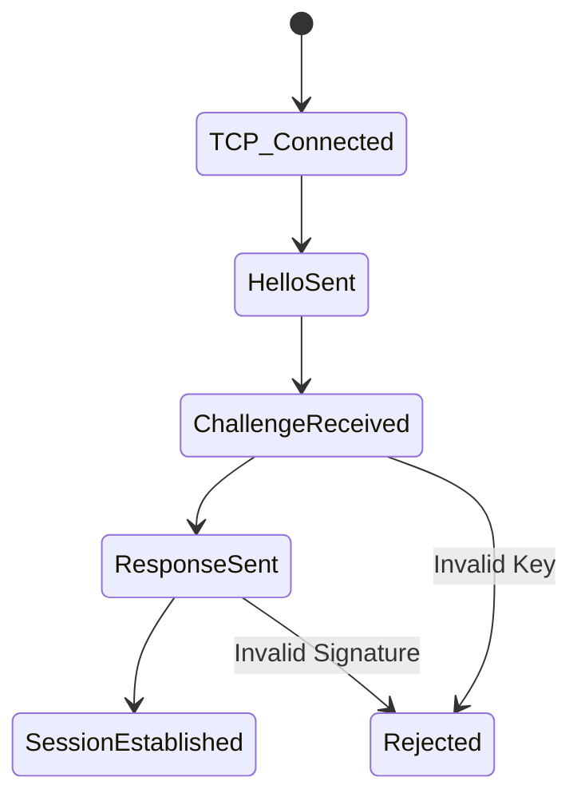
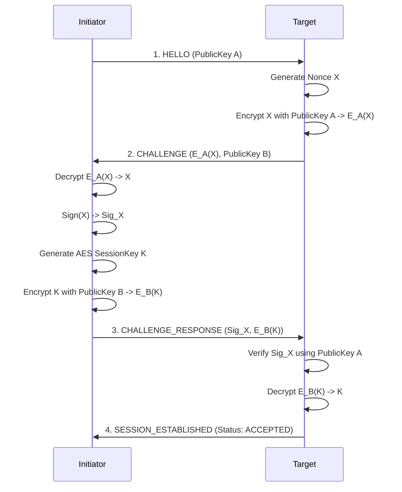

# Secure Handshake Protocol LLD

## Purpose
Define the custom 4-way cryptographic handshake protocol utilized by DevHub LAN to authenticate peers and securely establish a shared AES Session Key over an untrusted TCP connection.

## Goals
- **Mutual Authentication**: Both peers must prove they hold the private keys corresponding to their advertised public keys.
- **Secure Key Exchange**: Distribute a symmetric AES key without exposing it to packet sniffers.
- **Replay Protection**: Prevent an attacker from replaying an old handshake.

## Architecture

The `HandshakeManager` intercepts all inbound TCP connections. Before allowing any application-layer packets (like Chat or Room Sync) to flow, it enforces the 4-way state machine. During this time, application messages are held in a local `messageQueue`.

## Handshake State Machine

## The 4-Way Protocol

### Step 1: HELLO
**Initiator** connects to the **Target** and sends their Public Key.
*Purpose*: "I want to talk. Here is my ID."

### Step 2: CHALLENGE
**Target** generates a random 32-byte Nonce, encrypts it using the Initiator's Public Key, and sends it back.
*Purpose*: "Prove you actually own that ID by decrypting this random string."

### Step 3: CHALLENGE_RESPONSE
**Initiator** decrypts the Nonce using their Private Key. They then sign the decrypted Nonce to prove they read it. Furthermore, the Initiator generates a random `AES-256-GCM` Session Key, encrypts it with the Target's Public Key, and sends both back.
*Purpose*: "Here is the signed nonce proving I am me. Also, here is the secret AES key we will use for this session, securely wrapped for you."

### Step 4: SESSION_ESTABLISHED
**Target** verifies the signature on the Nonce. If valid, they decrypt the AES Session Key and store it in the `CryptoManager`. They reply with an ACK.
*Purpose*: "Identity verified. Key accepted. Proceed with encrypted transport."

## Sequence Flow

## Future Improvements
- **Diffie-Hellman Key Exchange**: The current implementation allows the Initiator to dictate the Session Key. A more robust implementation would use ECDH (Elliptic Curve Diffie-Hellman) where both parties contribute entropy to derive the key independently, eliminating the need to transmit the key over the wire at all.
