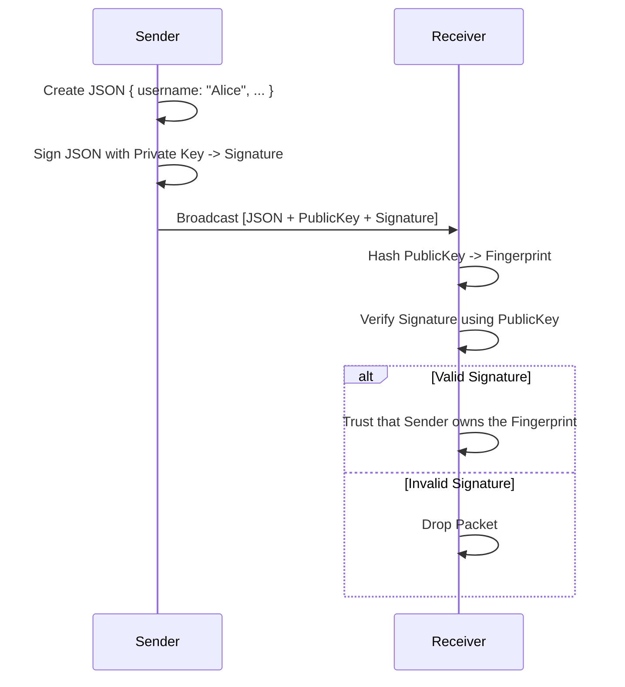

# Identity System LLD

## Purpose
Define the Identity System used by DevHub LAN to cryptographically identify devices without relying on a central authority, domain controller, or OAuth provider.

## Goals
- **Self-Sovereign Identity**: Devices generate their own immutable identities locally.
- **Spoofing Prevention**: Prevent an attacker from changing their username to impersonate another user.
- **Portability**: Identities are tied to the device, not an online account.

## Architecture

The `IdentityManager` acts as the root of trust for the local application. Upon first launch, it invokes the Node.js `crypto` module to generate a massive 4096-bit RSA key pair.

### The Identity Object

```typescript
interface DeviceIdentity {
  username: string;       // Mutable Display Name
  deviceName: string;     // OS Hostname
  publicKey: string;      // Immutable RSA Public Key (PEM format)
  privateKey: string;     // Immutable RSA Private Key (PEM format)
  fingerprint: string;    // SHA-256 Hash of Public Key
}
```

### Fingerprints
Because a 4096-bit PEM string is hundreds of lines long, we hash it using SHA-256 to create a `fingerprint`. This fingerprint acts as the definitive, immutable ID of the peer across the network.

## Storage Security
The `privateKey` must never leave the device. DevHub LAN leverages Electron's `safeStorage` API to encrypt the Identity object before writing it to `~/.devhub-lan/identity.json`. 

`safeStorage` utilizes the OS-native keychain:
- **macOS**: Keychain Access
- **Windows**: DPAPI / Credential Manager
- **Linux**: libsecret / Secret Service API

## Sequence Flow: Signed Discovery

Because the network cannot trust the `username` field in a UDP broadcast, every `DISCOVER` packet is signed.



## Future Improvements
- **Identity Portability**: Implement a secure "Export Identity" feature, allowing users to transfer their Private Key to a new laptop via a QR code or encrypted backup file.
