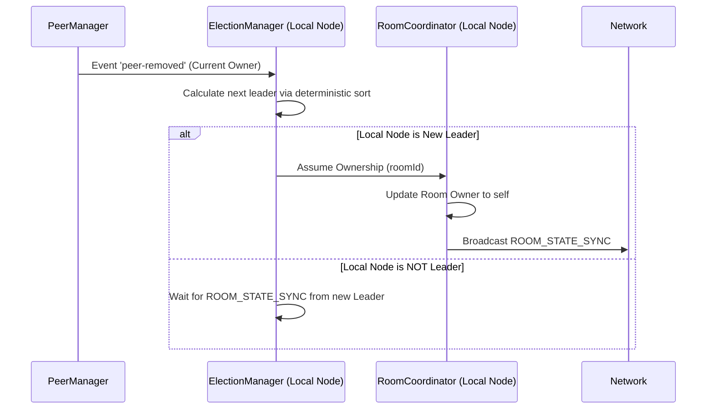

# Leader Election LLD

## Purpose
Define the Leader Election algorithm used by DevHub LAN to recover from Coordinator failures and maintain room availability in a distributed environment.

## Goals
- **Fault Tolerance**: A room must survive the sudden disconnection or crash of its owner.
- **Deterministic Consensus**: All remaining members must independently agree on who the new Leader is without requiring a central voting server.
- **Speed**: The election must resolve rapidly to prevent message dropping.

## Architecture

The `ElectionManager` monitors the health of the current Coordinator (Owner) by subscribing to UDP Presence timeouts in the `PeerManager`. If the Coordinator is marked offline, an election is instantly triggered.

## Design Decisions

### Algorithm Choice
Traditional consensus algorithms like Raft or Paxos are highly complex and require quorum voting, which is overkill for ephemeral LAN chat rooms. 

Instead, DevHub LAN uses a **Deterministic Fallback Algorithm**. Because every node maintains an identical synchronized list of Room Members (thanks to the Coordinator Pattern), all nodes can independently calculate who the next Leader should be.

### Election Rule
1. Remove the disconnected Coordinator from the member list.
2. Sort the remaining active members.
3. The member with the **lowest `peerId`** (alphabetical string comparison) is elected the new Coordinator.

*Note: In the future, this rule should prioritize the "Longest Connected Member", but `peerId` string comparison provides an immediate, foolproof deterministic result.*

## Sequence Flow

## Conflict Resolution (Split-Brain)
If the network partitions (e.g., a router restarts and splits the room in half), both halves will run an election and select different leaders. 

When the partition heals:
1. Two Coordinators exist for the same room.
2. They will both broadcast `ROOM_STATE_SYNC`.
3. The `RoomSync` module detects the conflict. The rule is strictly deterministic: The Coordinator with the lower `peerId` forces the other to step down.

## Future Improvements
- **Heartbeat Pings**: Currently, we rely on the 15-second UDP broadcast timeout to detect Coordinator failure. If the Coordinator crashes but the OS keeps the socket open, TCP writes might hang. Adding a 3-second TCP ping between the Coordinator and Members would vastly speed up failure detection.