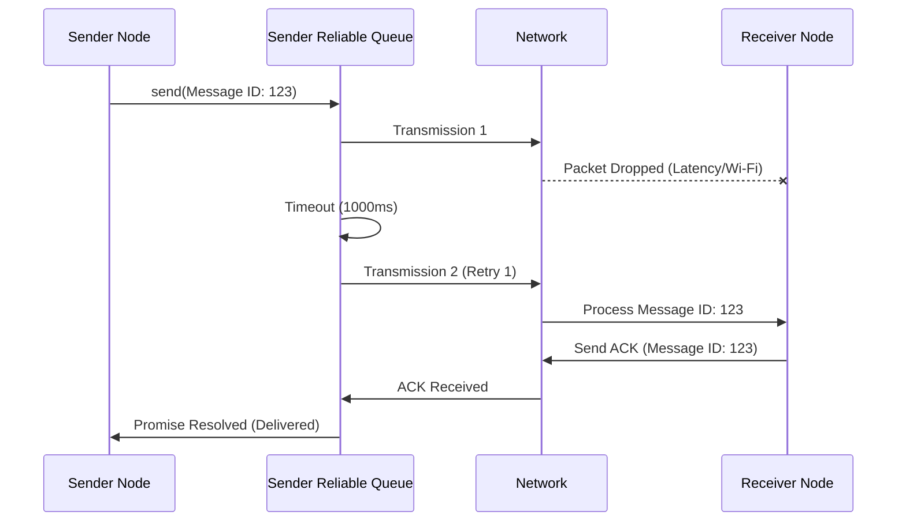

# Reliable Delivery LLD

## Purpose
Define the application-level reliable delivery system (ACKs and Retries) utilized in DevHub LAN to ensure messages are never dropped silently due to transient network failures.

## Goals
- **Guaranteed Delivery Detection**: The UI must accurately reflect whether a message reached its destination.
- **Automatic Retries**: Intermittent Wi-Fi drops should not require the user to click "Resend" manually.
- **Idempotency**: Retrying a message must not result in duplicate messages appearing in the chat.

## Architecture

The `ReliableSender` is a class residing in the Networking Layer that wraps standard `TcpClient` transmissions. 

Every packet that requires reliability must extend the `ReadReceiptPacket` format, ensuring it contains a unique `messageId`.

```typescript
export interface ReadReceiptPacket {
  type: string;
  messageId: string;
}
```

## Design Decisions

### TCP is Not Enough
While TCP guarantees that packets arrive in order and handles low-level retransmissions, it does not guarantee that the remote *application* actually processed the data. If the Node.js event loop crashes immediately after the OS TCP stack ACKs a packet, the data is lost. DevHub LAN implements an application-layer Acknowledgement (ACK) protocol to solve this.

### Retry Loop
When `sendWithRetry` is called:
1. The packet is fired over TCP.
2. A Promise is created and stored in a pending `Map`, keyed by `messageId`.
3. A `setTimeout` is started (typically 1000ms).
4. If the remote node receives the message, it immediately routes an `ACK` packet back.
5. If the `ACK` is received, the Promise resolves.
6. If the `setTimeout` fires before the `ACK` arrives, the packet is re-sent. This repeats up to 3 times before failing permanently.

### Idempotency (Deduplication)
Because the `ReliableSender` might send the same message 3 times (if the ACKs were dropped but the messages arrived), the receiving `MessageHandler` must implement deduplication.

The `MessageHandler` maintains an LRU Cache (or simple Set) of recently processed `messageId`s. If a duplicate arrives, it immediately ACKs it (to satisfy the sender) but does not pass it to the application state.

## Sequence Flow



## Future Improvements
- **Exponential Backoff**: Currently, the retry interval is fixed at 1000ms. Implementing an exponential backoff (e.g., 1000ms -> 2000ms -> 4000ms) would prevent network congestion during widespread drops.
- **Persistent Outbox**: If the application is completely closed while a message is in the `Failed` state, it is lost from RAM. Moving the Reliable Queue to SQLite or disk-backed storage would allow for true offline "Send Later" functionality.