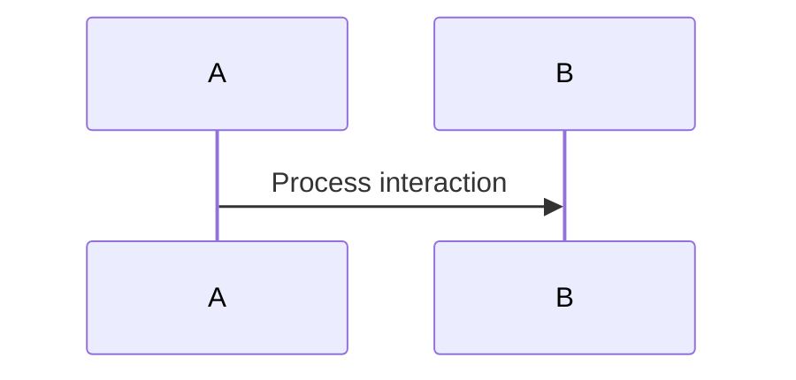

# Reliable Delivery LLD

## Purpose
Define the low-level architecture for Reliable Delivery.

## Goals
- Reliability
- Scalability
- Offline-first operation

## Design Decisions
Document the rationale behind specific code structures and data models.

## Sequence Flow

## Future Improvements
What can be optimized later.

---
*Last updated: 2026-06-11*