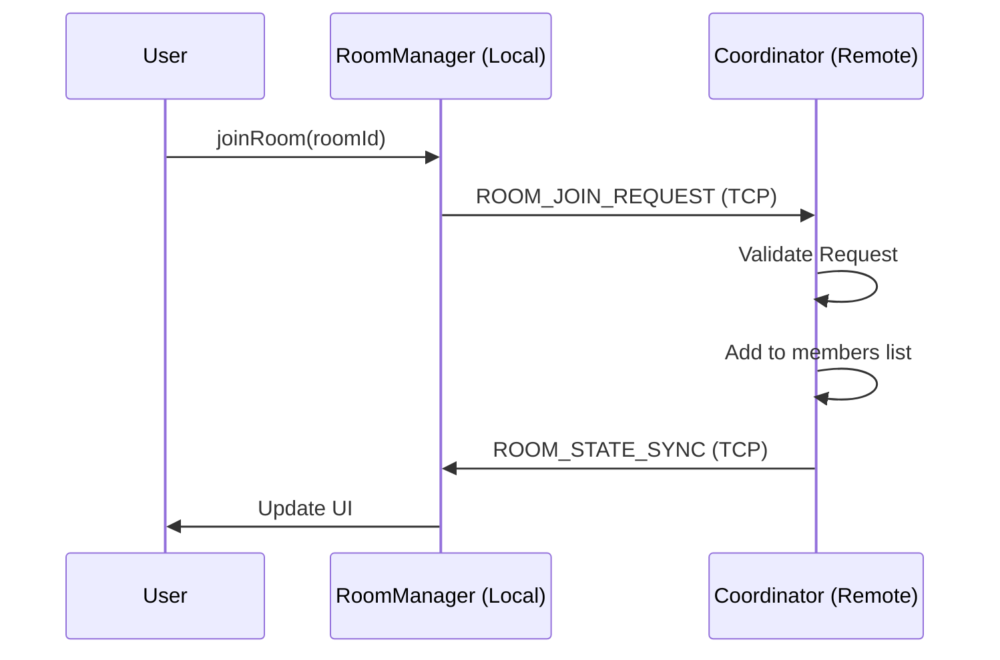

# Room Architecture LLD

## Purpose
Define the low-level architecture for the DevHub LAN Room system. Rooms serve as the primary abstraction for multi-user collaboration, creating isolated group chat environments and shared workspaces over a peer-to-peer network.

## Goals
- **Isolation**: Group conversations must be logically separated from direct messaging.
- **Persistence**: Room metadata and message histories must survive restarts.
- **Role Management**: Rooms must support basic permissions (Owner vs Member).
- **Consistency**: All participants in a room must share the same definitive view of the room's state.

## Architecture

The Room Architecture is composed of three primary managers in the Electron Main process:
1. `RoomManager`: Handles local CRUD operations, persistence to disk, and state exposure to the UI.
2. `RoomCoordinator`: Activated only if the local node is the "Owner" of a room. Responsible for distributing state and managing inbound messages.
3. `RoomSync`: Activated on all nodes. Responsible for receiving authoritative state updates from a RoomCoordinator and applying them locally.

## Design Decisions

### Data Model
Rooms are stored as simple JSON objects containing all necessary metadata. Because we operate in a distributed system, every room has a UUID, and every member is tracked by their `peerId` and `ip`.

```typescript
export interface Room {
  id: string;
  name: string;
  description: string;
  ownerId: string;
  createdAt: number;
  members: RoomMember[];
  settings: RoomSettings;
}

export interface RoomMember {
  peerId: string;
  ip: string;
  role: 'Owner' | 'Admin' | 'Member';
  joinedAt: number;
}
```

### Joining a Room
To prevent unauthorized entry (and to support private rooms in the future), peers cannot simply "add themselves" to a room. They must send a `ROOM_JOIN_REQUEST` to the current `ownerId` (the Coordinator). The Coordinator accepts the request and broadcasts a `ROOM_STATE_SYNC` packet containing the updated member list.

## Sequence Flow



## Future Improvements
- **Private Rooms**: Implement a password or invite-code system to encrypt room discovery and restrict `ROOM_JOIN_REQUEST`s.
- **Event Sourcing**: Instead of syncing the entire `Room` object via `ROOM_STATE_SYNC` whenever someone joins, sync individual delta events (e.g., `MEMBER_JOINED`, `MEMBER_LEFT`) to reduce bandwidth on large rooms.