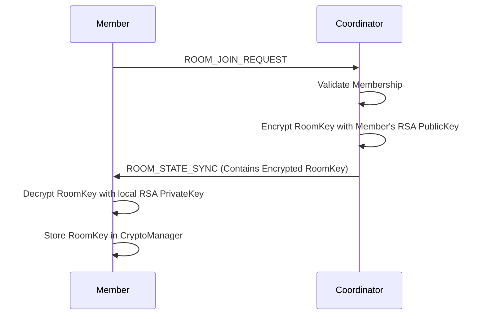
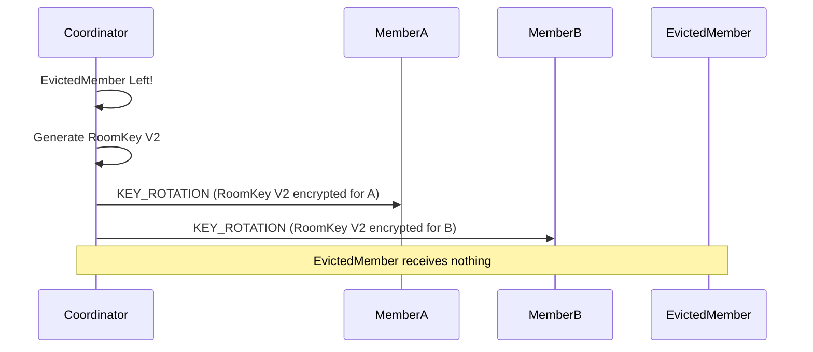

# Room Encryption LLD

## Purpose
Define the architecture for Room-Level Encryption in DevHub LAN. While point-to-point connections are encrypted with Session Keys, Rooms require a shared group key to ensure that only authorized members can participate in collaborative spaces.

## Goals
- **Group Confidentiality**: Non-members must not be able to read room messages, even if they intercept the TCP traffic.
- **Key Distribution**: The Coordinator must securely deliver the shared Room Key to authorized members.
- **Forward Secrecy (Rotation)**: When a member leaves, they must immediately lose the ability to decrypt future room messages.

## Architecture

Room Encryption operates independently of the transport-level Session Encryption. 

1. **Transport Layer**: Connects Peer A to the Coordinator. Encrypted with Session Key A.
2. **Application Layer**: Contains the Room Message. Encrypted with the Room Key.

This "Encryption in Depth" ensures that the Coordinator cannot be bypassed.

### The Room Key
When a Room is created, the Coordinator generates a 32-byte `AES-256-GCM` Room Key. This key is used by all members to encrypt payloads destined for that specific room.

## Sequence Flow: Key Distribution

When a member is accepted into a room, the Coordinator must transmit the Room Key. To do this securely, the Coordinator encrypts the Room Key using the new Member's RSA Public Key.

## Key Rotation (Eviction)

When a member leaves or is kicked from a room, the current Room Key is compromised because the departed member still possesses it.

To enforce access revocation:
1. The Coordinator generates a **New Room Key**.
2. The Coordinator iterates over the *remaining* active members.
3. The Coordinator encrypts the New Room Key with each remaining member's individual RSA Public Key.
4. The Coordinator broadcasts a `KEY_ROTATION` packet.

## Future Improvements
- **Message Ratcheting**: The current group encryption relies on the Coordinator generating and distributing a static symmetric key. Implementing a Double Ratchet algorithm (similar to Signal) would provide perfect forward secrecy at the group level, though the architectural complexity in a distributed mesh is exceedingly high.
