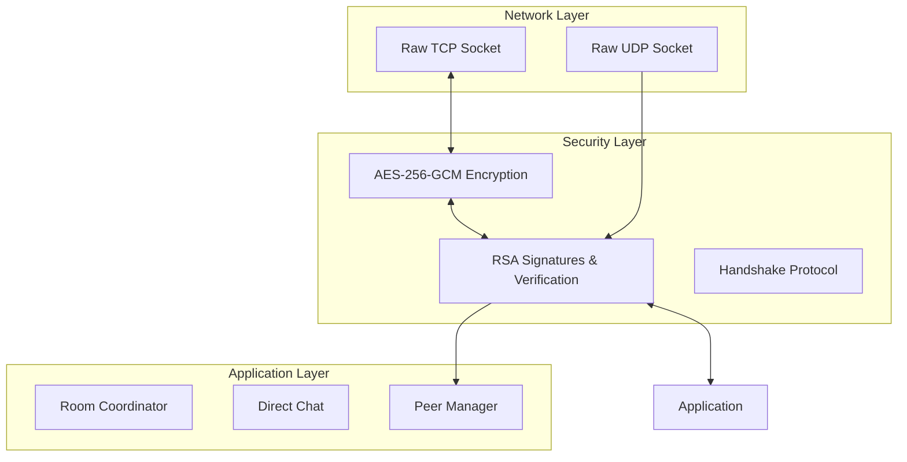

# Security Architecture LLD

## Purpose
Define the overarching security architecture for DevHub LAN. This document explains how the various cryptographic systems, identity managers, and networking layers interact to provide an end-to-end encrypted, zero-trust LAN environment.

## Goals
- **Zero-Trust**: Do not assume that any peer on the LAN is safe or authorized.
- **Data Confidentiality**: Ensure that packet sniffers on the Wi-Fi network cannot read chat or room data.
- **Data Integrity**: Guarantee that messages are not altered in transit.
- **Non-Repudiation**: Prove that a message was undeniably sent by a specific device.

## Core Components
The Security Architecture wraps the existing Phase 1 & 2 networking layers with five key managers:
1. `IdentityManager`: Manages the RSA-4096 key pair and creates signatures.
2. `CryptoManager`: Manages symmetric AES-256-GCM session keys.
3. `HandshakeManager`: Brokers the initial connection, exchanging challenges and keys.
4. `TrustManager`: Maintains the Access Control List (ACL) of Trusted/Blocked fingerprints.
5. `KeyRotationSystem`: Enforces forward secrecy by expiring keys.

## Layered Security Model

## Security Guarantees
- **Asymmetric Cryptography (RSA)** is used exclusively for *Authentication* (Signatures) and *Key Exchange* (Encrypting the Session Key).
- **Symmetric Cryptography (AES-GCM)** is used for *Transport Encryption* (Encrypting the actual message payload).
- **Authenticated Encryption with Associated Data (AEAD)** ensures that if a single bit of the AES ciphertext is flipped, the decryption will fail entirely, preventing padding oracle attacks and bit-flipping.

## Future Improvements
- **Forward Secrecy**: While AES keys are rotated, moving to an Elliptic Curve Diffie-Hellman (ECDHE) key exchange would provide true Perfect Forward Secrecy (PFS), guaranteeing that even if a private key is leaked in the future, past traffic cannot be decrypted.