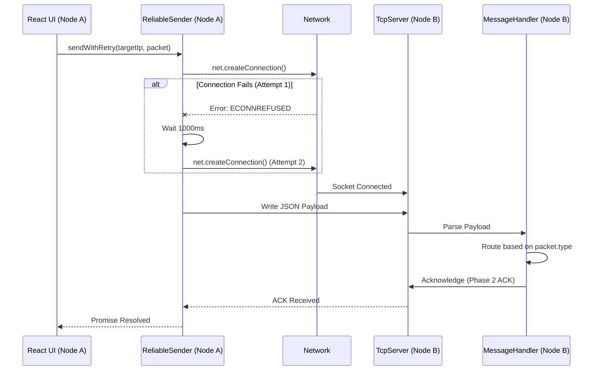

# TCP Messaging LLD

## Purpose
Define the low-level architecture for the DevHub LAN point-to-point messaging system. Once peers are discovered via the UDP Discovery System, all actual data transmission (messages, acknowledgements, room synchronization) occurs over direct TCP connections to ensure reliability and message ordering.

## Goals
- **Reliable Transport**: Guarantee that messages are delivered in the correct order.
- **Fault Tolerance**: Handle sudden socket closures, network drops, and `ECONNREFUSED` errors gracefully.
- **High Throughput**: Capable of handling rapid message bursts.
- **Decoupled Architecture**: Provide a clean API for higher layers (like the Room Coordinator) to send messages without worrying about socket management.

## Architecture

The messaging layer is composed of:
1. `TcpServer`: Listens on a dedicated port (`6000`) for incoming connections.
2. `TcpClient`: A lightweight wrapper around Node's `net.Socket` to initiate outbound connections.
3. `ReliableSender`: An abstraction over the `TcpClient` that implements retry logic, exponential backoff, and ensures packets are successfully transmitted.
4. `MessageHandler`: A central router that receives incoming TCP packets and routes them to the correct internal systems (Chat, Rooms, Security).

## Design Decisions

### Why Not HTTP?
While an HTTP server on each client would allow for simple REST interactions, it carries significant overhead for real-time chat. Raw TCP sockets allow for persistent connections (reducing handshake latency) and bidirectional streaming, which is critical for future features like code collaboration and screen sharing.

### Ephemeral vs Persistent Sockets
To conserve file descriptors and simplify state management in early phases, sockets are treated somewhat ephemerally for one-off messages but kept alive during rapid exchanges. The `ReliableSender` abstracts socket creation away from the application logic.

### Retry Mechanism
Network partitions are common on Wi-Fi. The `ReliableSender` implements a 3-attempt retry loop:
1. Attempt to connect and write.
2. If it fails (e.g., `ECONNRESET`), wait 1000ms.
3. Retry connection.
4. If it fails after 3 attempts, bubble the error up to mark the message as "Failed" in the UI.

## Sequence Flow

### Send and Retry Flow

### Packet Routing

When `TcpServer` receives data, it passes it to `MessageHandler`, which acts as an internal API router:
- `type: 'CHAT'` -> Emits to IPC for UI rendering.
- `type: 'ROOM_*'` -> Routes to `RoomCoordinator` or `RoomSync`.
- `type: 'HELLO' | 'CHALLENGE'` -> Routes to `HandshakeManager`.

## Future Improvements
- **Message Framing**: Currently, we rely on TCP chunks arriving as complete JSON strings or implement simple delimiter framing. For Phase 4 (File Transfer), we must implement strict length-prefixed framing (e.g., 4 bytes indicating payload length) to prevent chunk fragmentation errors on large payloads.
- **Connection Pooling**: Instead of opening and closing sockets for intermittent messages, maintain a pool of multiplexed persistent sockets to high-traffic peers.