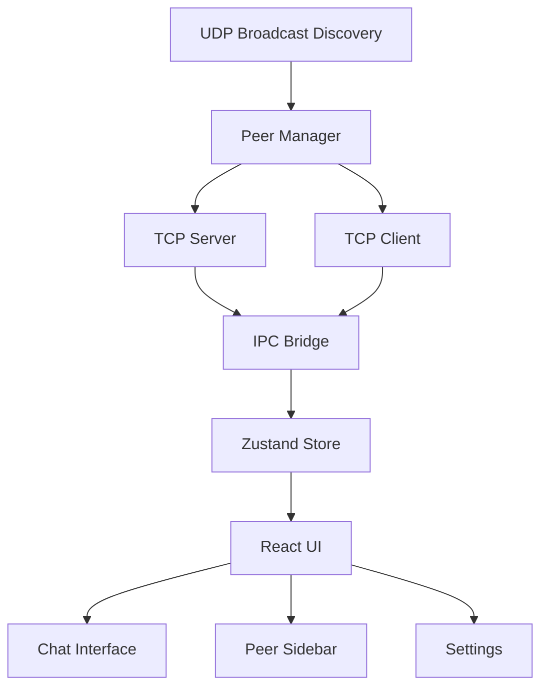
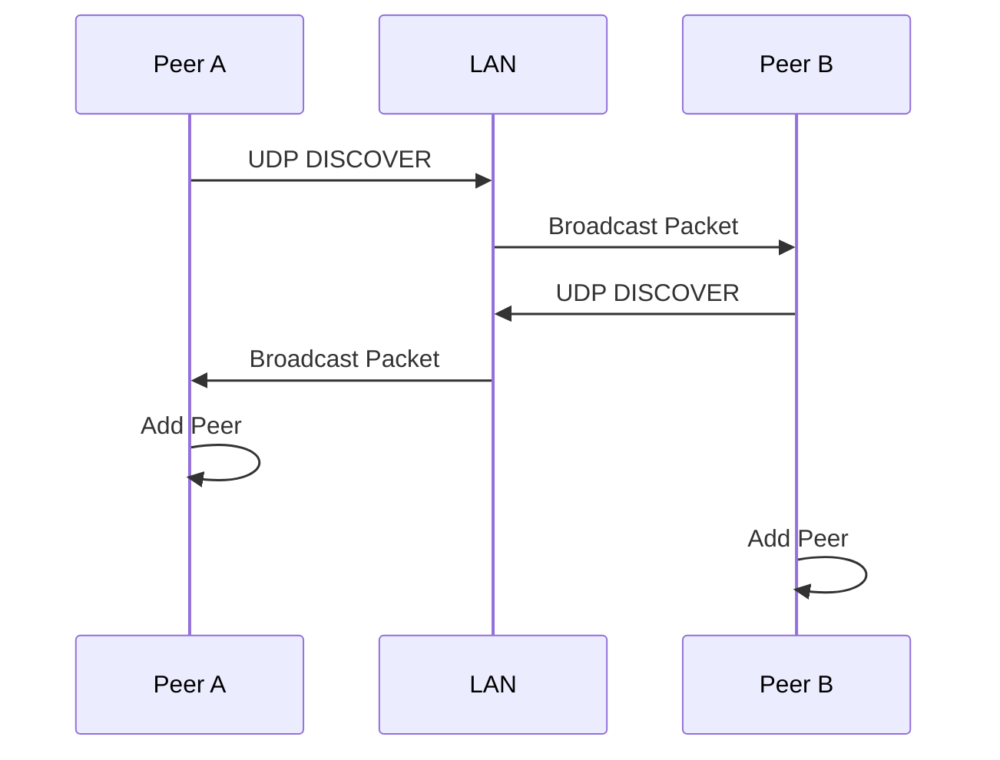
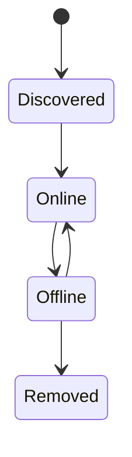
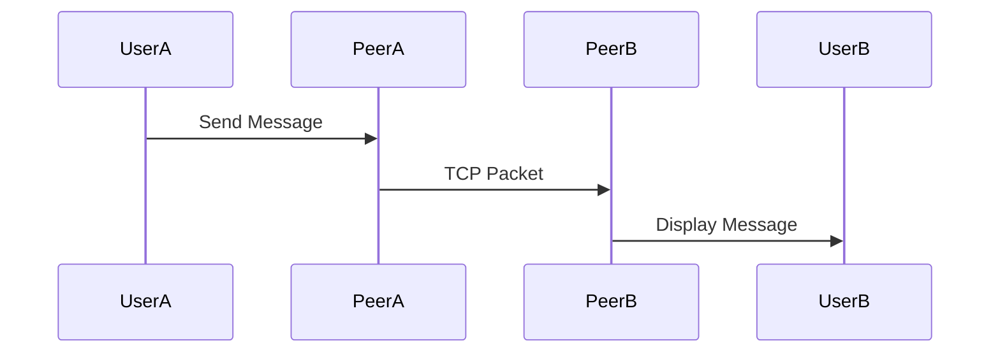
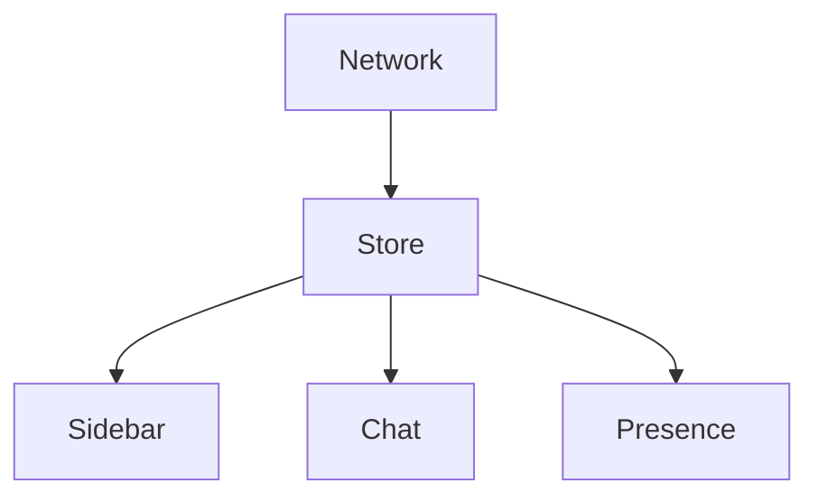

# Phase 01 — Core LAN Communication

**Building the foundation of a serverless, peer-to-peer LAN collaboration platform.**

---

## Overview

DevHub LAN is designed as an offline-first developer collaboration platform that operates entirely inside a local network without relying on cloud infrastructure.

Phase 1 focused on solving three fundamental problems:
1. Peer Discovery
2. Direct Communication
3. Real-Time Messaging

The result is a working LAN-based messaging system where devices automatically discover each other and communicate directly using TCP sockets.

---

## Objectives

### Goals
- Zero cloud dependency
- Fully offline operation
- Automatic peer discovery
- Real-time communication
- Low latency messaging
- Cross-platform support
- Electron desktop application

---

## System Architecture



### Components
- **UDP Broadcast Discovery**: Emits and listens for presence packets on the LAN to discover active devices automatically.
- **Peer Manager**: Tracks online/offline states of discovered devices and filters out stale peers.
- **TCP Server/Client**: Establishes reliable, persistent point-to-point connections for messaging.
- **IPC Bridge**: Safely bridges backend Node.js networking events to the React frontend.
- **Zustand Store**: Maintains synchronous application state (peers, chat history) locally without a database.
- **React UI**: Renders the developer-focused chat interface, peer list, and identity settings.

---

## Networking Design

### Why Not Socket.io?

Traditional real-time web applications rely on Socket.io connected to a centralized WebSocket server. While reliable, this design breaks down without an active internet connection or a dedicated local server.

- No central server required
- No internet dependency
- Direct LAN communication scales naturally
- Better understanding of low-level networking concepts
- Reduced middleman latency

> [!NOTE]
> **Design Decision:**
> DevHub LAN intentionally avoids Socket.io and centralized servers in favor of direct TCP communication to maintain complete LAN independence.

---

## Peer Discovery System

### Problem Statement
How can devices discover each other automatically on a LAN without a centralized registry or DNS server?

### Solution: UDP Broadcast Discovery
We implemented a UDP broadcast mechanism where every instance of DevHub LAN actively announces its presence.
- **Port**: 5000
- **Broadcast Interval**: Every 5 seconds
- **Format**: Lightweight JSON payload containing identity and connection details.
- **Status Tracking**: The peer list dynamically updates, adding new peers and marking unresponsive ones as offline.

### Discovery Flow



### Peer Lifecycle



**Timeout Mechanism**: A strict 15-second inactivity rule is enforced. If a peer misses 3 consecutive broadcast intervals, the Peer Manager transitions their state to `Offline`.

---

## TCP Communication Layer

### Problem Statement
Once peers are discovered via UDP, how should real-time messages be reliably exchanged? (UDP guarantees no delivery order or reliability).

### Solution: Direct TCP Sockets
We established direct point-to-point TCP socket connections between peers.
- **Port**: 6000
- **Reliable Transport**: TCP guarantees packet order and delivery.
- **Persistent Connections**: Connections are maintained to reduce handshake latency.
- **Bidirectional Communication**: Enables seamless back-and-forth messaging.

### Message Flow



---

## IPC Architecture

DevHub LAN strictly adheres to Electron's process separation model for security and performance.

- **Main Process Responsibilities**: Node.js APIs, UDP discovery, TCP networking, and peer state management.
- **Renderer Responsibilities**: React UI rendering, user interactions, and local state management via Zustand.


---

## State Management

We implemented Zustand to manage the volatile application state efficiently.

### Store Responsibilities
- **Peer List**: Real-time updates of online/offline LAN devices.
- **Active Chat**: Tracking the currently focused conversation.
- **Message History**: In-memory storage of direct messages.
- **Connection State**: Global app networking status.
- **User Settings**: Local identity and avatar preferences.



---

## User Experience

### Components

#### Settings Modal
**Purpose**: Configure local identity (Username, Device Name, Avatar) which is subsequently broadcasted across the LAN.

#### Peer Sidebar
**Purpose**: Display discovered devices in real-time, grouped by their connection status (Online/Offline).

#### Chat Window
**Purpose**: The primary interface for direct point-to-point communication between peers.

---

## Packet Structures

### Discovery Packet
Broadcasted over UDP to announce presence.
```typescript
export interface DiscoveryPacket {
  type: 'DISCOVER';
  username: string;
  deviceName: string;
  ip: string;
  tcpPort: number;
  timestamp: number;
}
```

### Chat Packet
Sent over TCP for reliable message delivery.
```typescript
export interface ChatMessage {
  type: 'CHAT';
  messageId: string;
  sender: string;
  timestamp: number;
  content: string;
}
```

---

## Security Considerations

### Current Limitations
In Phase 1, the platform operates purely on trust:
- No encryption (Plaintext JSON)
- No authentication
- No trust verification or spoofing protection

### Reason
Security was intentionally deferred to Phase 3 to focus exclusively on solving the distributed networking and state management challenges first.

---

## Challenges Encountered

- **LAN Peer Discovery**: Ensuring UDP broadcasts reached all subnets and handling varied OS firewall rules.
- **Duplicate Peers**: Preventing the UI from flashing or duplicating entries when multiple UDP packets arrived quickly.
- **Self-Discovery Filtering**: Writing logic to ignore our own UDP broadcasts so we don't chat with ourselves.
- **Device Timeouts**: Balancing the UDP heartbeat interval with the timeout threshold to prevent ghost offline states.
- **TCP Connection Management**: Handling sudden socket drops and `ECONNREFUSED` errors gracefully.

---

## Key Learnings

- **UDP is excellent for discovery**: It is lightweight, fast, and perfect for "shouting" into a network without needing a handshake.
- **TCP provides reliable messaging**: Handling chunked data and ensuring delivery order is complex; TCP abstracts this perfectly for point-to-point chat.
- **Electron enables deep networking access**: Accessing Node's `dgram` and `net` modules directly in the Main process is incredibly powerful compared to traditional browser constraints.
- **P2P systems require lifecycle management**: Unlike client-server models, peers disappear constantly. Robust state reconciliation is critical.

---

## Phase 1 Deliverables

- [x] UDP Discovery
- [x] TCP Messaging
- [x] Peer Manager
- [x] IPC Layer
- [x] Zustand Store
- [x] Settings System
- [x] Real-Time Chat UI
- [x] Presence Tracking

---

## Metrics

| Component        | Status   |
| ---------------- | -------- |
| Discovery Layer  | Complete |
| Messaging Layer  | Complete |
| UI Layer         | Complete |
| IPC Layer        | Complete |
| State Management | Complete |

---

## Future Evolution

Phase 1 successfully established the **Discovery Layer**, **Communication Layer**, and **State Layer**. 

These core components became the direct foundation for Phase 2, which introduced:
- Rooms
- Group Messaging
- Leader Election
- Collaboration Features

---

## Conclusion

Phase 1 transformed DevHub LAN from a concept into a functioning peer-to-peer LAN communication platform. By proving that robust discovery and direct messaging could be achieved without centralized infrastructure or external cloud services, we laid the critical groundwork required for all future distributed collaboration features.