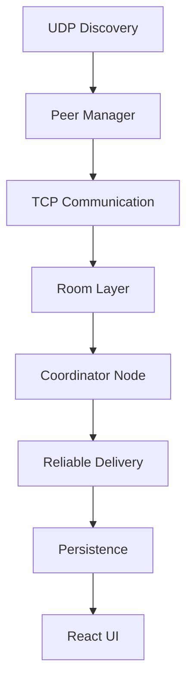
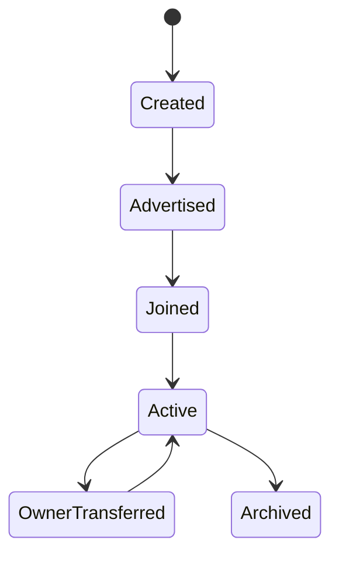
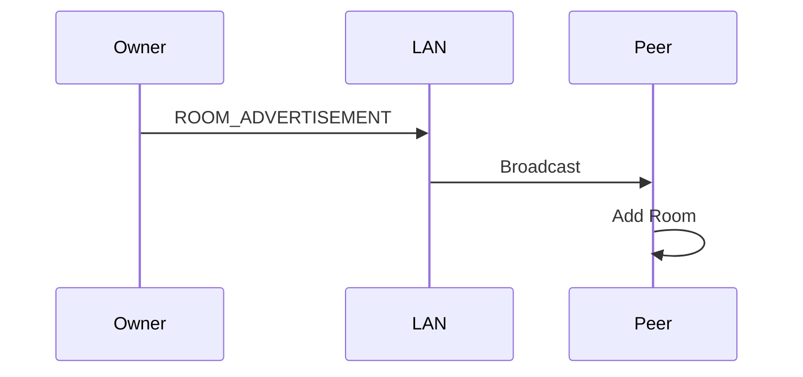
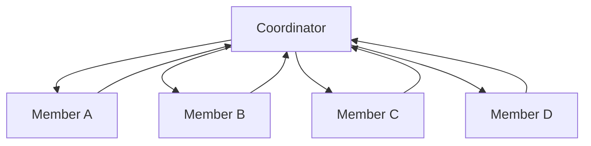
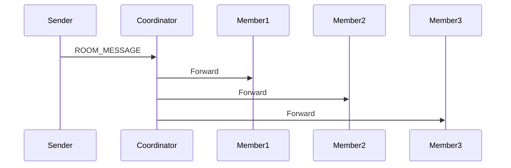
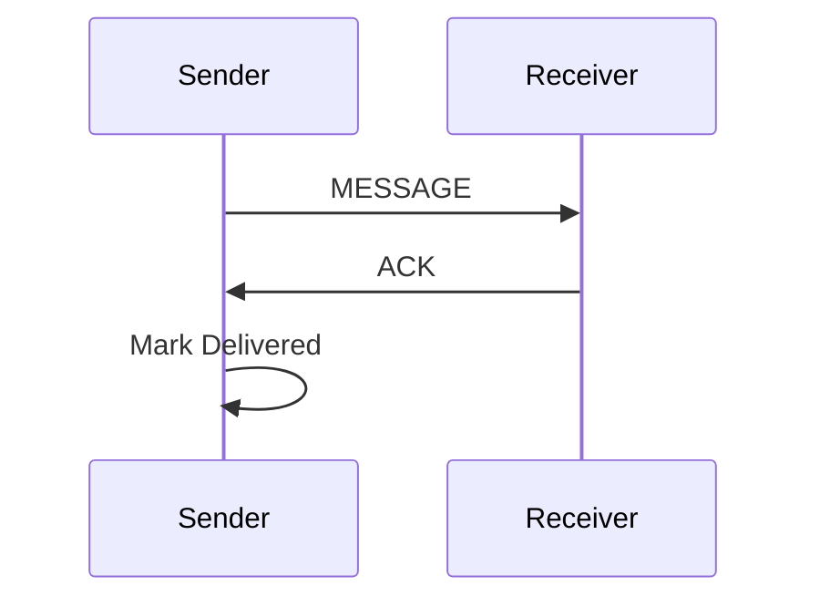
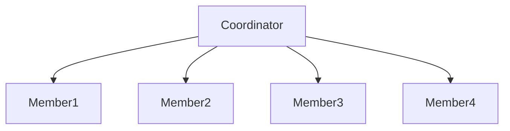
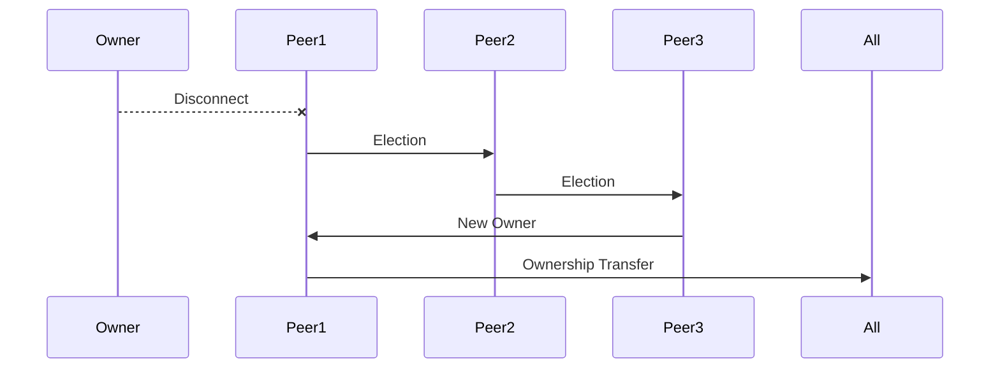

# Phase 02 — Rooms & Collaboration

**Transforming DevHub LAN from peer-to-peer messaging into a distributed collaboration platform.**

---

## Overview

Phase 1 successfully solved:
- Peer Discovery
- Direct Messaging
- Presence Tracking

Phase 2 introduces collaborative communication through distributed rooms.

The objective was to allow multiple peers to communicate inside shared spaces while maintaining state synchronization without relying on any centralized server or database.

This phase introduced several distributed systems concepts to the platform:
- Room Architecture
- Group Messaging
- Reliable Delivery
- Coordinator Nodes
- Leader Election
- Room State Synchronization
- Message Persistence

---

## Objectives

### Goals
- Multi-user collaboration
- Group messaging
- Room discovery
- Room ownership
- Reliable delivery
- Fault tolerance
- Automatic recovery
- Persistent room history

---

## High-Level Architecture



### Layer Responsibilities
- **Room Layer**: Defines the data models, logic, and state bounds for group workspaces.
- **Coordinator Node**: The centralized source-of-truth for a specific room within the decentralized mesh.
- **Reliable Delivery**: Guarantees application-level message transmission, preventing dropped messages during network latency.
- **Persistence**: Ensures room settings, member lists, and histories survive application restarts.

---

## Why Rooms?

### Problem Statement
Direct peer-to-peer messaging works well for isolated one-to-one communication. 

However, professional collaborative environments require:
- Team discussions
- Shared topical channels
- Group coordination and scheduling
- Membership and role management

A formal **Room Abstraction** was introduced to solve this problem, creating isolated networking topologies on top of the existing TCP mesh.

---

## Room Architecture

A room acts as a virtual boundary containing an explicitly defined list of authorized members, policies, and history.

### Room Entity

```typescript
interface Room {
  id: string;
  name: string;
  ownerId: string;
  members: RoomMember[];
  createdAt: number;
  settings: {
    private: boolean;
    allowFileTransfer: boolean;
  };
}
```

---

## Room Lifecycle

Rooms have a strictly defined lifecycle that survives the departure of their original creator.



- **Created**: Instantiated locally by the founder.
- **Advertised**: Broadcasted to the LAN via UDP.
- **Active**: Functioning normally with exchanging messages.
- **OwnerTransferred**: The coordinator dropped offline, triggering an election that nominates a new owner.

---

## Room Discovery System

### Problem
How can peers discover active rooms without a central directory or server?

### Solution: UDP Room Advertisements
Room owners periodically broadcast room metadata on the LAN alongside their presence packets.

- **Packet Type**: `ROOM_ADVERTISEMENT`
- **Data Payload**: Room Name, ID, Description, and Owner IP.

### Discovery Flow



When a peer receives the advertisement, the room is rendered in the UI sidebar, allowing them to explicitly request to join it over TCP.

---

## Coordinator Architecture

### Problem
Pure mesh networking (where every peer is connected to every other peer and broadcasts every message to everyone) becomes computationally expensive and prone to race conditions.

For `N` members, the required Mesh Connections scale at:
`N × (N - 1)`

This complexity increases rapidly and causes major synchronization conflicts when multiple users type simultaneously.

### Solution: Coordinator Model
The room owner acts as a temporary **Coordinator Node** (a micro-server) strictly for that specific room.

**Responsibilities:**
- Membership management (Accepting/Rejecting joins)
- Message distribution (Routing)
- State synchronization (Enforcing ordering)

### Coordinator Topology



**Benefits**: Messages are linearly serialized by the Coordinator, ensuring everyone in the room views the exact same timeline of events without race conditions.

---

## Group Messaging

### Message Flow



When a member sends a message to the room, they transmit it solely to the Coordinator. The Coordinator validates the packet, assigns an authoritative timestamp, and multiplexes it to all other active members.

---

## Reliable Delivery System

### Problem
TCP guarantees transport reliability. However, application-level delivery still needs confirmation.

Examples of TCP edge-cases:
- The app crashes immediately after the OS accepts the socket write.
- The Coordinator restarts mid-transmission.
- Sudden Wi-Fi dropouts.

### Solution: ACK-Based Delivery
We implemented an application-layer Acknowledgement (ACK) protocol.

**Message States**:
- `Sending`: Sitting in local queue.
- `Sent`: Successfully written to TCP socket.
- `Delivered`: Received explicit ACK from the remote application layer.
- `Failed`: Timed out after maximum retries.

### Delivery Flow



### Retry Mechanism
- **Timeout duration**: 1000ms.
- **Retry count**: 3 automatic retries.
- **Failure state handling**: If ACK is not received after 3 retries, the message is marked visually as "Failed" in the UI, allowing manual user intervention.

---

## State Synchronization

### Problem
Because there is no central database, all room members must share the exact same room state locally.

### Events Requiring Sync
- Member joined
- Member left
- Owner changed (Leader Election)
- Room metadata updated
- Role updated

### Sync Architecture



The Coordinator periodically broadcasts a `ROOM_STATE_SYNC` packet containing the definitive JSON representation of the room to force eventual consistency across all peers.

---

## Leader Election

### Problem
Coordinator failure. What happens if the room owner abruptly disconnects or closes their laptop?

### Solution: Automatic Leader Election
If the Coordinator goes offline, the remaining peers must nominate a new Coordinator to prevent the room from freezing.

**Rule**: Longest Connected Active Member Wins.
**Fallback**: Lowest Peer ID (Alphabetical username resolution) in the event of a tie.

### Election Flow



When the new owner is confirmed, they assume Coordinator responsibilities and broadcast a `ROOM_STATE_SYNC` declaring their new status.

---

## Fault Tolerance

- **Coordinator Failure**: Detected via UDP timeout. Triggers Leader Election.
- **Network Interruption**: Messages are queued locally by the `ReliableSender`.
- **Room Recovery**: Rooms survive network drops and re-sync automatically upon reconnection.
- **Member Reconnection**: Disconnected members request the latest missed states from the Coordinator upon rebooting.

---

## Persistence Layer

- **Room Storage**: Room metadata is serialized to local JSON files (`rooms.json`).
- **Message History**: SQLite or File-system based archival for previous chats.
- **Membership Cache**: Remember who was in the room to allow for offline reading.

**Persistence Goals**:
- Survive full application restart
- Restore rooms seamlessly
- Restore chat history instantly

---

## UI Evolution

**Phase 1**:
- Peer List
- Direct Chat

**Phase 2**:
- Rooms Sidebar
- Expandable Member List
- Group Chat Interface
- Room Management Modal (Creation/Roles)

---

## Security Considerations

### Current State (Phase 2)
- Rooms are publicly discoverable on the LAN.
- Messages are transmitted in plaintext JSON.
- No cryptographic authentication prevents username spoofing.

### Reason
Security was deferred. Phase 2 focused entirely on the heavy distributed systems logic (Coordination, State Sync, Leader Election).

**Phase 3** introduces the security layer, directly patching these vulnerabilities via:
- Identity Generation (RSA)
- E2EE Encryption (AES)
- Trust Management
- Secure Handshakes

---

## Challenges Encountered

- **Distributed room ownership**: Designing an election algorithm that works without a central clock.
- **Message duplication**: Handling cases where the ACK is dropped but the message was delivered.
- **State consistency**: Resolving conflicts when two peers try to join simultaneously.
- **Coordinator failover**: Handling the edge case where the Coordinator drops offline mid-transmission.
- **Reliable delivery**: Building custom retry queues without relying on heavyweight message brokers like RabbitMQ.

---

## Key Engineering Learnings

- **Distributed systems require ownership models**: In a mesh network, designating temporary central coordinators drastically simplifies state management.
- **Reliability exists above transport layers**: TCP is not enough. You must build application-layer acknowledgments.
- **State synchronization is difficult**: Eventual consistency requires robust logic to handle out-of-order events.
- **Failure handling must be designed early**: Writing the "Happy Path" is easy. Engineering for sudden disconnects is the hardest part of P2P.

---

## Phase 2 Deliverables

- [x] Room Creation
- [x] Room Discovery
- [x] Group Messaging
- [x] Coordinator Architecture
- [x] Reliable Delivery
- [x] ACK System
- [x] State Synchronization
- [x] Leader Election
- [x] Persistence Layer
- [x] Multi-User Collaboration UI

---

## Metrics

| Component             | Status   |
| --------------------- | -------- |
| Room Layer            | Complete |
| Coordinator System    | Complete |
| Leader Election       | Complete |
| Reliable Delivery     | Complete |
| Synchronization Layer | Complete |
| Persistence Layer     | Complete |

---

## Future Evolution

Phase 2 established the core distributed capabilities:
- Collaboration Layer
- Ownership Model
- Reliability Layer
- Distributed Coordination

These complex systems become the robust foundation for **Phase 3**:
- Identity System
- Cryptography
- Secure Sessions
- Trusted Devices
- Encrypted Rooms

---

## Conclusion

Phase 2 successfully transformed DevHub LAN from a basic messaging application into a powerful distributed collaboration platform. By implementing Coordinator Nodes, Leader Election, and Application-Layer Acknowledgements, we proved that fault-tolerant, scalable group communication is entirely possible without relying on centralized cloud infrastructure.
