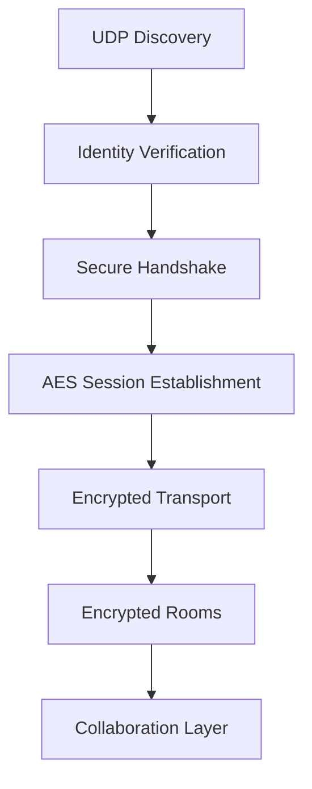
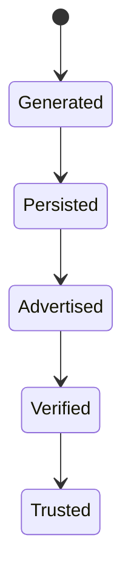
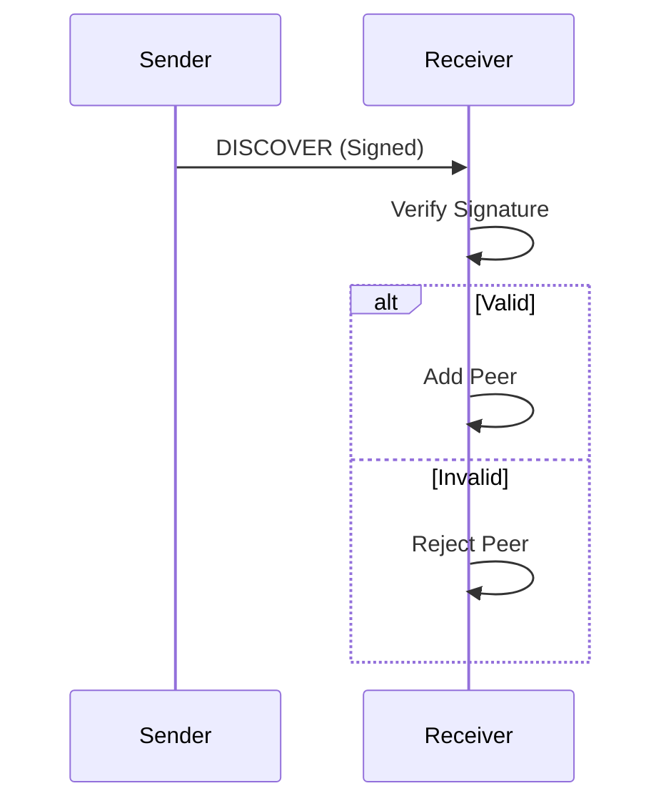
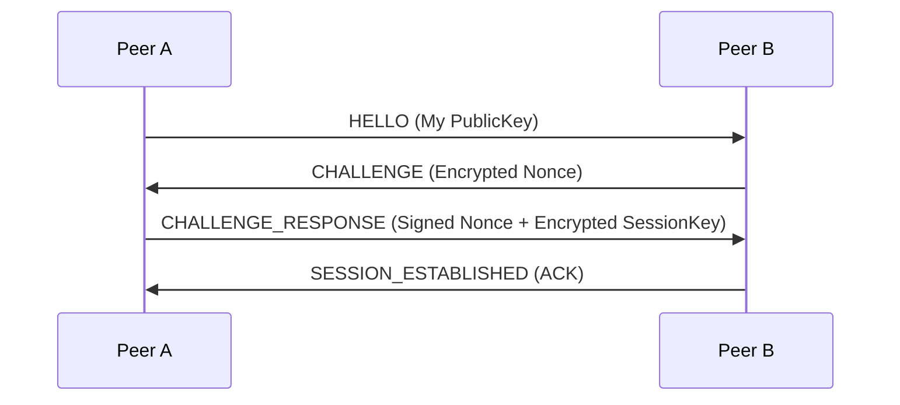
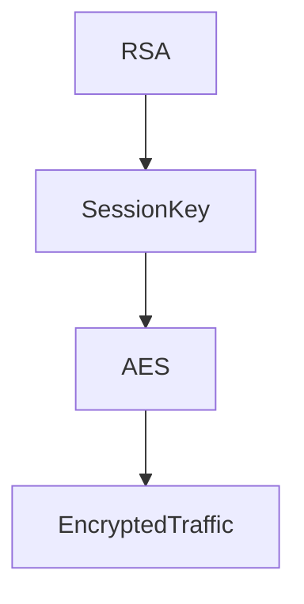
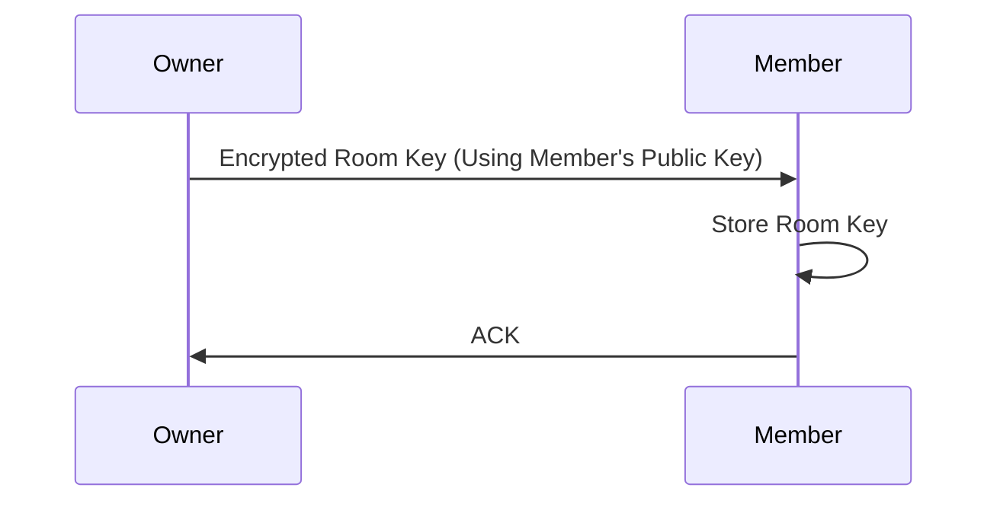
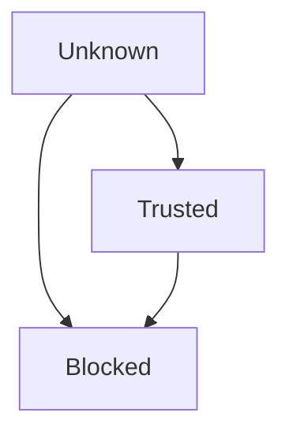
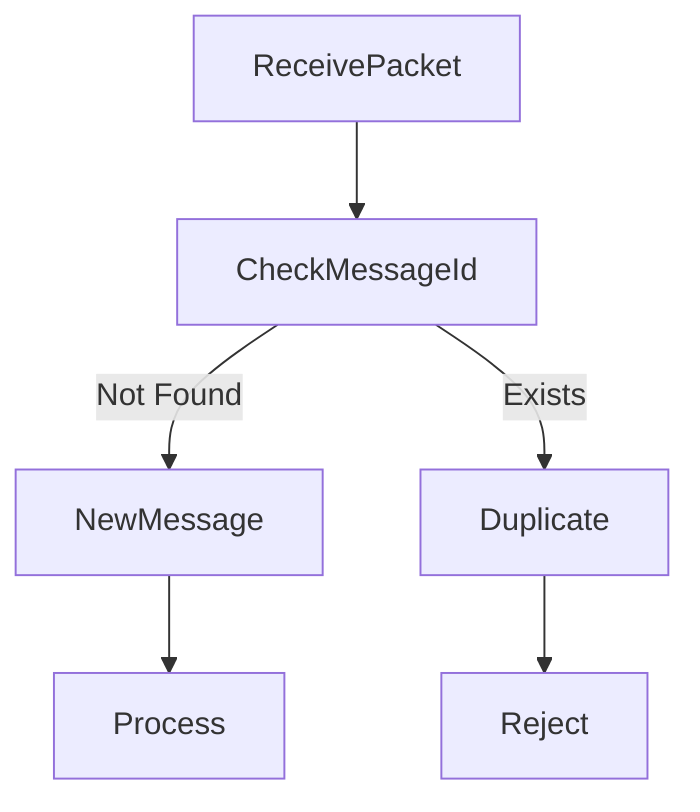

# Phase 03 — Security & Trust Infrastructure

**Building a secure, encrypted, and trusted collaboration layer for DevHub LAN.**

---

## Overview

Phase 1 introduced:
- Peer Discovery
- Direct Communication

Phase 2 introduced:
- Rooms
- Coordination
- Reliable Delivery
- Leader Election

Phase 3 introduces:
- Device Identity
- Authentication
- Encryption
- Trust Management
- Secure Communication

The objective was to ensure that every communication inside DevHub LAN can be authenticated, encrypted, and protected from impersonation, packet tampering, and unauthorized access.

---

## Objectives

### Goals
- Secure peer authentication
- End-to-end encrypted communication
- Device trust verification
- Room-level encryption
- Secure key management
- Replay attack prevention
- Secure local storage
- Security auditing

---

## Security Architecture



### Layer Responsibilities
- **UDP Discovery**: Broadcasts signed identity packets instead of plaintext.
- **Identity Verification**: Validates incoming RSA signatures before recognizing a peer.
- **Secure Handshake**: A custom 4-way protocol to exchange cryptographic challenges.
- **AES Session Establishment**: Exchanging symmetric keys securely via asymmetric cryptography.
- **Encrypted Transport**: The Reliable Delivery system transparently wraps all payloads in AES-256-GCM.
- **Encrypted Rooms**: The Coordinator handles room-specific key distribution.
- **Collaboration Layer**: The application operates normally, unaware of the complex encryption happening underneath.

---

## Threat Model

DevHub LAN is designed to mitigate the following specific LAN-based threats:

### Threats
- **Device impersonation**: A malicious node claiming to be the CTO.
- **Packet tampering**: Man-in-the-middle (MITM) modifying chat payloads in transit.
- **Unauthorized room access**: A packet sniffer trying to read private room data.
- **Replay attacks**: An attacker capturing an old "Delete Room" packet and sending it again.
- **Session hijacking**: Taking over an established TCP socket.
- **Message forgery**: Sending messages that appear to come from another user.
- **Malicious peers**: Dealing with a compromised or blocked node continuing to broadcast.

---

## Identity System

### Problem
How can peers prove their identity without a central authority (like a Certificate Authority or OAuth provider)?

### Solution: Device-Based Cryptographic Identity
Each installation generates a unique RSA-4096 key pair on the very first launch. This key pair represents the immutable identity of the device.

```typescript
interface DeviceIdentity {
  peerId: string;
  publicKey: string;
  privateKey: string;
  fingerprint: string;
}
```

- **Identity Generation**: Key pairs are generated securely via Node's `crypto` module.
- **Peer IDs**: A user-friendly alias chosen by the user.
- **Fingerprints**: A SHA-256 hash of the `publicKey`, acting as the true unique identifier of the device.
- **Local Persistence**: Stored via Electron's `safeStorage` (encrypted at rest by OS keychains).

---

## Identity Lifecycle



---

## Discovery Packet Security

Discovery packets are no longer purely plaintext. They have been upgraded to carry identity proofs.

**Discovery packet contains:**
- `peerId`: The display name.
- `publicKey`: The device's public key.
- `timestamp`: Current time to prevent long-term replay.
- `signature`: The RSA signature of the above fields.

---

## Verification Flow



---

## Secure Handshake Protocol

Before any application data is exchanged over TCP, peers must authenticate each other and establish a shared symmetric session key.

**Protocol Packets:**
- `HELLO`: Initiates the intent to connect, exposing public keys.
- `CHALLENGE`: Contains an RSA-encrypted random nonce.
- `CHALLENGE_RESPONSE`: The decrypted nonce, signed by the recipient's private key to prove ownership, bundled with a proposed AES session key.
- `SESSION_ESTABLISHED`: Final acknowledgement or rejection.

---

## Handshake Sequence



**Purpose of each step:**
- **HELLO**: Identity declaration.
- **CHALLENGE**: Verifies that Peer A actually owns the Private Key corresponding to their Public Key.
- **CHALLENGE_RESPONSE**: Peer A proves ownership and securely transmits the AES Session Key that will be used for the duration of the TCP connection.
- **SESSION_ESTABLISHED**: Signals the start of encrypted transport.

---

## Cryptography Stack

| Purpose | Algorithm | Rationale |
|---|---|---|
| **Identity** | `RSA-4096-OAEP` | Industry standard for asymmetric identity and key exchange. |
| **Session Encryption** | `AES-256-GCM` | Extremely fast symmetric encryption with built-in authenticated encryption (AEAD) to prevent tampering. |
| **Hashing** | `SHA-256` | Used for generating short, verifiable device fingerprints. |
| **Signatures** | `RSA-SHA256` | Ensures non-repudiation of messages and discovery packets. |
| **Randomness** | `crypto.randomBytes` | Cryptographically secure pseudo-random number generator for nonces and session keys. |

---

## Session Establishment

The stack relies on a hybrid encryption approach.

**RSA is used exclusively for:**
- Authentication (Signatures)
- Session key exchange (Encrypting the AES key)

**AES is used exclusively for:**
- Actual communication (Encrypting the large JSON payloads of application data)

---

## Session Flow



---

## Message Encryption

Every application-layer message (Chat, Room Sync, etc.) is wrapped securely before touching the socket.

**Before Send:**
1. Serialize Plaintext JSON
2. Encrypt with AES-256-GCM
3. Sign the encrypted buffer with RSA
4. Transmit over TCP

**After Receive:**
1. Receive Raw Buffer
2. Verify RSA Signature
3. Decrypt with AES-256-GCM
4. Process Plaintext JSON

---

## Room Encryption

Group communication requires shared access. The Room Coordinator generates a unique AES key specifically for the room.

### Room Key Distribution



- **Join flow**: When a member is approved, the Coordinator securely transmits the Room Key.
- **Leave flow**: Handled locally; key rotation ensures they cannot read future messages.
- **Access revocation**: Triggers an immediate key rotation event across all active members.

---

## Trust Management

DevHub LAN adopts a deliberate Trust Model where connections are not implicitly trusted just because they are on the LAN.

### Trust Levels

```typescript
enum TrustLevel {
  UNKNOWN,   // Discovered, valid signature, but unverified by the user
  TRUSTED,   // Explicitly approved by the user
  BLOCKED    // Explicitly banned by the user
}
```

- **First contact**: Devices start as `UNKNOWN`.
- **Trust approval**: The user must visually verify the device Fingerprint in the UI.
- **Blocking devices**: `BLOCKED` devices have their UDP packets dropped immediately, and TCP connections are forcefully closed without handshake.

---

## Trust Flow



---

## Replay Attack Protection

To prevent an attacker from recording a legitimate encrypted packet and sending it later, every packet includes strictly validated metadata.

- **Nonces**: Handshake randomization.
- **Timestamps**: Packets older than 60 seconds are discarded immediately.
- **Message IDs**: Unique UUIDs for every payload.
- **Replay Cache**: An LRU cache tracks the last 1000 processed `messageId`s.

---

## Replay Prevention Flow



---

## Key Rotation

Long-lived cryptographic keys are a security risk. Key rotation limits the damage of a compromised session.

- **Session Key Rotation**: Every 30 minutes. The TCP connection is briefly paused, a new AES key is exchanged via RSA, and the connection resumes.
- **Room Key Rotation**: Every 24 hours.

**Triggers**:
- Time expiration
- Member Join
- Member Removal
- Ownership Transfer (Leader Election)

---

## Security Event Logging

A dedicated `SecurityLogManager` records critical security events to disk for auditing:
- Failed handshakes (mismatched signatures)
- Invalid signatures on standard messages
- Replay attacks (duplicate Message IDs)
- Blocked device connection attempts
- Key rotations

---

## Secure Storage

Cryptography is only as secure as the private key storage.

**Stored Securely:**
- Private Keys
- Trust Lists
- Session Metadata
- Room Keys

**Storage Mechanism**: DevHub LAN leverages Electron's `safeStorage` API. This automatically encrypts local JSON files at rest using the operating system's native keychain (Keychain Access on macOS, Credentials Management on Windows, secret service on Linux).

---

## Security Dashboard

A new UI component was built to expose the Security Infrastructure to the user.

**Sections:**
- **Identity**: Displays local Public Key and Fingerprint.
- **Trust**: Manages the list of Trusted and Blocked fingerprints.
- **Sessions**: Live view of active AES session keys.
- **Logs**: Real-time auditing of security events.

*(Screenshots to be added)*

---

## Performance Impact

- **Encryption overhead**: AES-256-GCM is highly hardware-accelerated and introduces <1ms of latency per message.
- **Signature verification cost**: RSA verification is heavier than AES, but manageable for chat.
- **Session management cost**: Handshakes take ~3 round trips, adding a slight delay to the very first message sent to a peer.

**Optimizations**: Symmetric keys (AES) are used for bulk encryption because asymmetric (RSA) encryption is thousands of times slower and incapable of encrypting large payloads.

---

## Challenges Encountered

- **Secure key exchange**: Implementing a handshake protocol from scratch without TLS requires handling race conditions manually.
- **Trust management**: Designing a UI that makes cryptographic fingerprints understandable to regular developers.
- **Replay protection**: Balancing LRU cache sizes with memory usage while ensuring older packets are properly rejected by timestamp.
- **Session lifecycle**: Syncing the exact moment a Session Key rotates between two peers so they don't drop messages in transit.
- **Distributed encryption**: Handling the complex logic of distributing new Room Keys via RSA to every member whenever the room topology changes.

---

## Key Engineering Learnings

- **Cryptography should be layered**: RSA is for identity and exchange; AES is for transport.
- **Trust must be explicit**: Cryptography proves *who* sent the message, but Trust proves *if* you actually want to talk to them.
- **Authentication is separate from encryption**: You can receive an encrypted packet, but if it lacks a valid signature, it is useless.
- **Security affects architecture decisions**: Adding security requires fundamental changes to the underlying TCP and UDP layers, making it significantly harder to implement retrospectively.

---

## Phase 3 Deliverables

- [x] Device Identity System
- [x] Signed Discovery
- [x] Secure Handshake
- [x] AES-GCM Sessions
- [x] Message Signing
- [x] Trusted Devices
- [x] Room Encryption
- [x] Replay Protection
- [x] Key Rotation
- [x] Security Dashboard

---

## Metrics

| Component          | Status   |
| ------------------ | -------- |
| Identity Layer     | Complete |
| Trust Layer        | Complete |
| Handshake Protocol | Complete |
| Session Encryption | Complete |
| Room Encryption    | Complete |
| Security Dashboard | Complete |

---

## Future Evolution

Phase 3 established the deeply integrated cryptographic core:
- Identity Layer
- Trust Layer
- Encryption Layer

These strictly secure foundations become the baseline requirement for **Phase 4**:
- Secure File Transfer
- Project Synchronization
- Integrity Verification

---

## Conclusion

Phase 3 transformed DevHub LAN from a functional distributed collaboration platform into a **secure** distributed system. By implementing custom asymmetric identity verification, hybrid AES/RSA encryption, explicit trust management, and strict replay attack protection, DevHub LAN is now capable of authenticated, encrypted, and trusted communication without relying on any external infrastructure, cloud providers, or certificate authorities.
